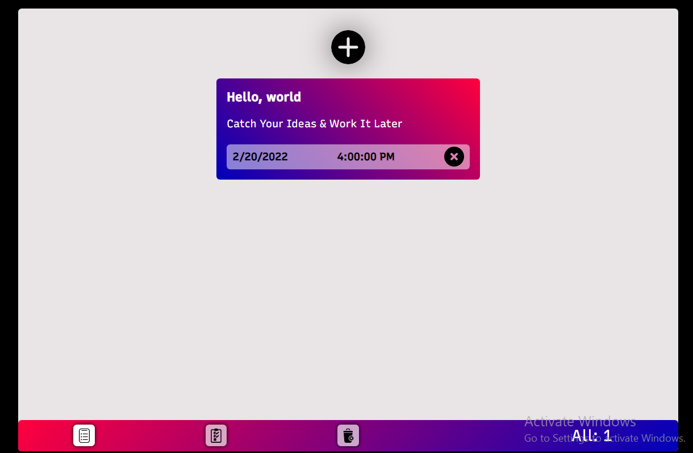

# Reminder App 

Catch Your Ideas & Work It later.

# Preview Link

[Preview Link](https://ali-sabry.github.io/reminder-app/)

# General info

This application helps you to save your thoughts or create an alert to remind you of something you want to do later. The application saves all reminders even after closing the browser. The application shows you the browser notification at the exact time for each reminder, Storing Data On LocalStorage.

# Technologies

- Html5
- Css3 || Sass
- Javascript(ES6)

# Lincess

********************************\*\*********************************/

- Author : [Ali sabry](https://www.linkedin.com/in/ali-sabry/)
- Created : 2021.

- All Copyright Reserved To Author [Ali sabry](https://www.linkedin.com/in/ali-sabry/)
